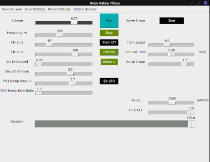

# noise-making-thingy

### Audio frequency modulation with sliders in a gui

**Just Click Play!**
Its a bit like a synthesizer.
Sine wave being modulated by a sine wave. Can select a log ramp or another sine to alter the modulating phase and frequency by toggling the
'Log Ramp / Sin LFO' button.
Now with optional triangle wave.

Another modulator can be added by clicking the 'FM2' button. In fact **click it straight away!**

Could not decide on tremelo or ring modulator so its sort of a highbred...for now,
below 0.5 on the slider Trem Amount setting its a tremelo, and above 0.5 its a ring modulator.
There's other sliders for sliding too.
Stop with the stop button at any time. Duration can be set from half second to 3 minutes.

There is also a crappy white noise button. Don't bother clicking that one... Or should you?

Now you can save the beautiful sounds you make as a .wav file in the project folder.
Or just save the settings to be recalled later. These options are on the menu bar.

Also from the menu bar you can open dialogue to set a different output device like
a usb audio interface for instance.

## python3

### dependences

```
pip3 install numpy
pip3 install scipy
pip3 install sounddevice
```
Also tkinter.

```
sudo apt-get install python-tk
```

#### Then run it.

```
python3 noise_making_thingy.py
```



Wanna listen to it on youtube?... No?...
With  a 15 msec real time oscillogram? click [this](https://youtu.be/YvmN32klURU).
